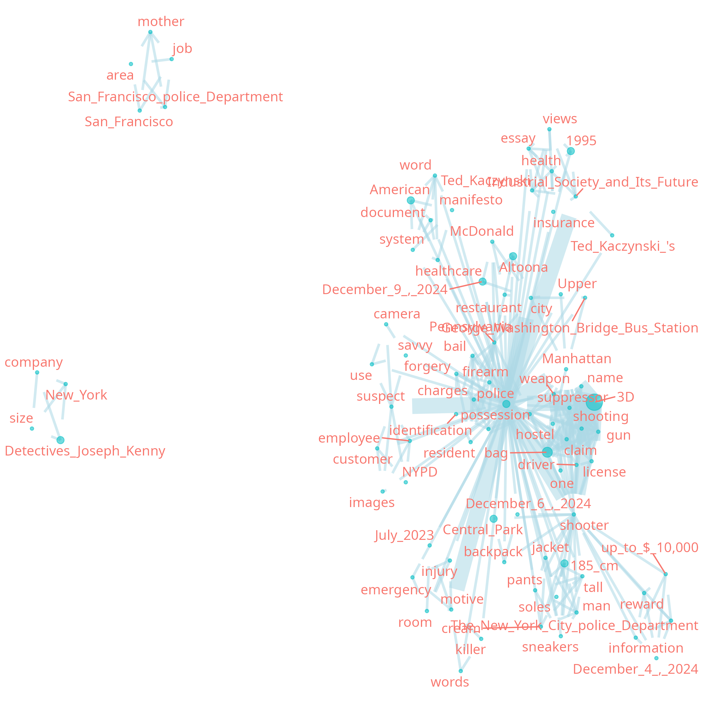
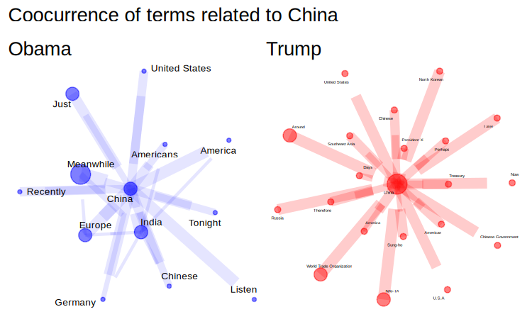

{networds} - package to build text network
================

<!-- README.md is generated from README.Rmd. Please edit that file -->

# {networds} - a package to build graphs from text

<!-- badges: start -->

<!-- badges: end -->


**THIS PACKAGE IS NOW UNDER DEVELOPMENT**

# Extracting co-occurences and relations in text

This is a package to extract graphs and build and visualize text
networks in static and dynamic graphs.

It extracts graphs from plain text using:

1)  Rule based: Regex to extract proper names, and build a co-occurrence
    network
2)  (under development) Extraction using Part of Speech tagging of
    proper names and nouns and its co-occurrence

- extraction of relations (verbs, in most cases) like in
  {[rsyntax](https://github.com/vanatteveldt/rsyntax)} and
  {[semgram](https://github.com/omstuhler/semgram)}, that uses
  [Universal Stanford Dependencies: A cross-linguistic
  typology](https://nlp.stanford.edu/pubs/USD_LREC14_paper_camera_ready.pdf)
  “propose an improved taxonomy to capture grammatical relations across
  languages, including morphologically rich ones”

3)  (Under development) Relation extraction using Large Language Models
    running locally with
    {[rollama](https://github.com/JBGruber/rollama)}.

The method 1 is quick and easy to understand and to explain, but has its
limitations. Method 2 and 3 are still under development and are more
powerful, and can solve more complex problems. One of the problems is
disambiguation, the same word can have different meanings depending on
the context. Other problem, that can be solved with methods two and
three, is possible to do what is called “anaphora resolution”, when
there is repeated reference to the same entities with different words.
<!-- _"In computational linguistics, Ruslan Mitkov defined anaphora as a phenomena of pointing back a previously mentioned item in the text"_ (Font: [A Survey on Semantic Processing Technique](https://arxiv.org/pdf/2310.18345)),  -->
for example, in the phrase: “John Doe gave Mary a flower and she loved
it,” the pronoun “she” is the anaphor of “Mary” and “it” is the anaphor
of “flower”. The opposite case, when a pronoun precedes its referent, it
is called cataphora. We are working on the implementation of this
feature to reduce the number of redundant nodes.

## Installation

You can install the development version of networds from
[GitHub](https://github.com/) with:

``` r
# install.packages("pak")
pak::pak("SoaresAlisson/networds")
```

## Example

<figure>

<figcaption aria-hidden="true">Ex. graph POS</figcaption>
</figure>

<figure>

<figcaption aria-hidden="true">Obama and Trump SOTU about
China</figcaption>
</figure>

Check the vignettes:  
<!-- - [01 - Proper name extraction with regex](https://htmlpreview.github.io/?https://raw.githubusercontent.com/SoaresAlisson/networds/refs/heads/master/vignettes/entities_and_relation_extraction.html) -->
<!-- - [02 - Extract entity co-ocurrences with POS] -->

- [website of the project](https://soaresalisson.github.io/networds)

## Similar Projects

- [textnet](https://github.com/ucd-cepb/textnet) - “textNet is a set of
  tools in the R language that uses part-of-speech tagging and
  dependency parsing to generate semantic networks from text data. It is
  compatible with Universal Dependencies and has been tested on
  English-language text data”.
- [textnets](https://github.com/cbail/textnets) from Chris Bail.
