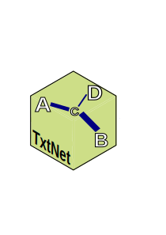

{txtnet} - package to build text network
================

<!-- README.md is generated from README.Rmd. Please edit that file -->

# {txtnet} - a package to build graphs from text

<!-- badges: start -->
<!-- badges: end -->



**THIS PACKAGE IS NOW UNDER DEVELOPMENT**

# Extracting co-occurences and relations in text

This is a package to extract graphs and build and visualize text
networks in static and dynamic graphs.

It extract graphs from plain text using:

1)  Rule based: Regex to extract proper names, and build a co-occurrence
    network
2)  (under development) Extraction using Part of Speech tagging of
    proper names and nouns and its co-occurrence

- extraction of relations (verbs, in most cases) like in {rsyntax} and
  {semgram}

3)  (Planned future development) Maybe a relation extraction using Local
    Large Language Models with {rollama}.

[Universal Stanford Dependencies: A cross-linguistic
typology](https://nlp.stanford.edu/pubs/USD_LREC14_paper_camera_ready.pdf)
“propose an improved taxonomy to capture grammatical relations across
languages, including morphologically rich ones”

## Installation

You can install the development version of txtnet from
[GitHub](https://github.com/) with:

``` r
# install.packages("pak")
pak::pak("SoaresAlisson/txtnet")
```

## Example

<figure>

<figcaption aria-hidden="true">Ex. graph POS</figcaption>
</figure>

<figure>

<figcaption aria-hidden="true">Obama and Trump SOTU about
China</figcaption>
</figure>

Check the vignettes:  
- [01 - Proper name extraction with
regex](https://htmlpreview.github.io/?https://raw.githubusercontent.com/SoaresAlisson/txtnet/refs/heads/master/vignettes/entities_and_relation_extraction.html) -
\[02 - Extract entity co-ocurrences with POS\]

## Similar Projects

- [textnet](https://github.com/ucd-cepb/textnet) - “textNet is a set of
  tools in the R language that uses part-of-speech tagging and
  dependency parsing to generate semantic networks from text data. It is
  compatible with Universal Dependencies and has been tested on
  English-language text data”.
- [textnets](https://github.com/cbail/textnets) from Chris Bail.
